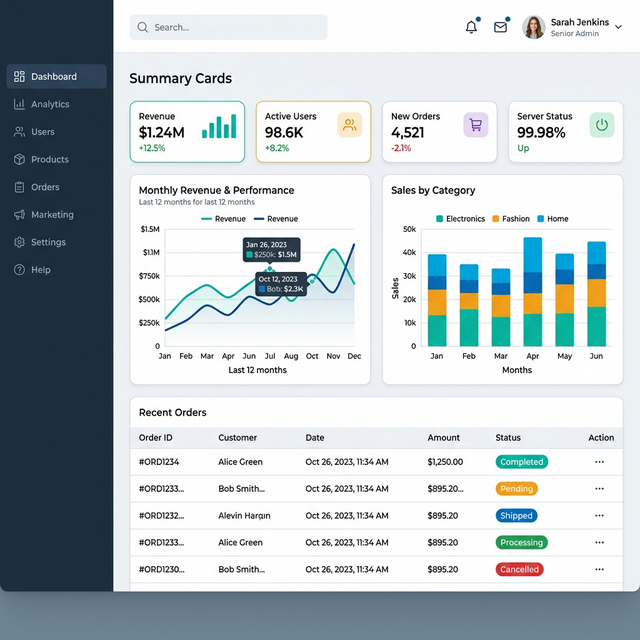

# 🚀 Modern Admin Panel: Full-Stack Enterprise Solution



A high-performance, senior-level full-stack admin panel built with modern technologies. This project features a robust backend architecture and a stunning, responsive frontend designed for enterprise-grade applications.

## ✨ Key Features

- **🔐 Advanced Authentication**: Secure JWT-based authentication with role-based access control (RBAC).
- **📊 Real-time Analytics**: Dynamic charts and performance metrics using Recharts.
- **👤 User Management**: Comprehensive CRUD operations for user profiles and permissions.
- **📦 Product Inventory**: Streamlined management of products with status tracking.
- **🌓 Adaptive UI**: Seamless dark and light mode support with modern typography.
- **📱 Ultra-Responsive**: Fully optimized for mobile, tablet, and desktop viewports.

## 🛠️ Technology Stack

### Frontend (Client)
- **Next.js 15+** (App Router)
- **React 19**
- **Redux Toolkit** (State Management)
- **Tailwind CSS** (Styling)
- **Lucide React** (Icons)
- **Recharts** (Data Visualization)
- **Axios** (API Requests)

### Backend (Server)
- **Node.js & Express**
- **MongoDB & Mongoose** (Database)
- **JWT & Bcrypt** (Security)
- **Zod** (Schema Validation)
- **Morgan & Helmet** (Middleware)

## 🚀 Getting Started

### Prerequisites
- Node.js (v18+)
- MongoDB (Local or Atlas)
- npm or yarn

### Installation

1. **Clone the repository:**
   ```bash
   git clone https://github.com/salma-lams/Admin_Panel.git
   cd Admin_Panel
   ```

2. **Setup Backend:**
   ```bash
   cd server
   npm install
   # Create a .env file based on .env.example
   npm run build
   npm start
   ```

3. **Setup Frontend:**
   ```bash
   cd ..
   npm install
   # Create a .env file
   npm run dev
   ```

### Demo Credentials
- **Email**: `admin@admin.com`
- **Password**: `Admin@123`

## 🏗️ Project Structure

```text
Admin_Panel/
├── server/             # Express API
│   ├── src/
│   │   ├── controllers/
│   │   ├── models/
│   │   ├── routes/
│   │   └── utils/
│   └── tsconfig.json
└── src/                # Next.js Frontend
    ├── app/           # App Router
    ├── components/    # Reusable UI
    ├── features/      # Business logic
    ├── store/         # Redux state
    └── lib/           # Utilities
```

## 📜 License

This project is licensed under the MIT License - see the [LICENSE](LICENSE) file for details.

---
Built with ❤️ by [salma-lams](https://github.com/salma-lams)
